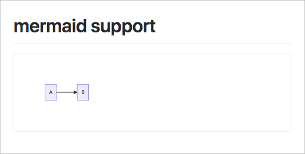

# markdownarea.js

[](https://travis-ci.org/negokaz/markdownarea.js) [](https://github.com/negokaz/markdownarea.js/releases/latest) 

In-browser, markdown documentation tool.

[Demo](https://negokaz.github.io/markdownarea.js)

## Usage

```html
<!DOCTYPE html>
<html>
    <body>
        <textarea class="markdownarea">
            # markdownarea.js

            In-browser, markdown documentation tool.

            - Easy to use :)
            - Markdown extended syntax available :sunglasses:
            - **Only need** single HTML file :rocket:
        </textarea>
        <script src="https://cdn.jsdelivr.net/gh/negokaz/markdownarea.js@v0.4.0/dist/markdownarea.js"></script>
    </body>
</html>
```

↓ Markdown (in `markdownarea`) is rendered as HTML.


### Write graphs, diagrams and flowcharts

You can use [mermaid](https://mermaidjs.github.io/) in Markdown.

```html
<!DOCTYPE html>
<html>
    <body>
        <textarea class="markdownarea">
            # mermaid support

            <!-- ↓ write codes as "mermaid" -->
            ```mermaid
            graph LR;
                A-->B;
            ```
        </textarea>
        <!-- ↓ include mermaid -->
        <script src="https://unpkg.com/mermaid@7.1.2/dist/mermaid.min.js"></script>
        <script src="https://cdn.jsdelivr.net/gh/negokaz/markdownarea.js@v0.4.0/dist/markdownarea.js"></script>
    </body>
</html>
```



## TODO

- [ ] Size specified image

## Licence

Copyright (c) 2018 Kazuki Negoro

markdownarea.js is released under the [MIT License](./LICENSE)
